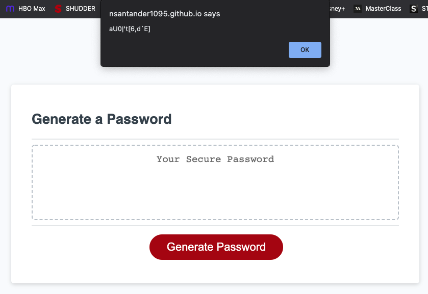

# Password Generator Refactor Project

## Table of Contents
1. [Description](#description)
2. [Visuals](#visuals)

## Description

The password generator site web app now has a JavaScript file that gives it all of the necessary functionality, as outlined. Now, when you click the button, there are a series of prompts that begin with one that asks you to choose a password length of between 8-128 characters. Next, it will ask whether to include uppercase, lowercase, numeric, or special characters (excluding 'space') and it will generate a password matching that criteria. The password is then presented in an alert to the user.

## Visuals
